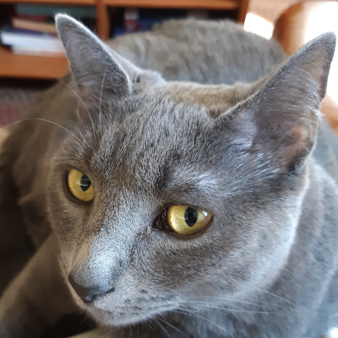
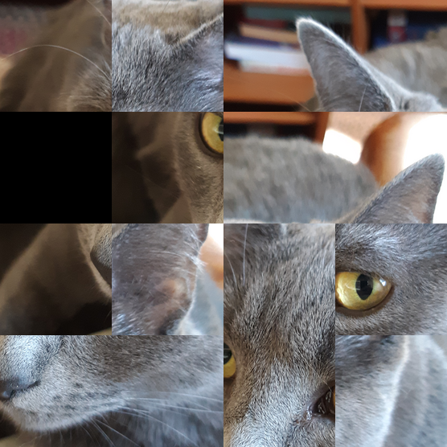
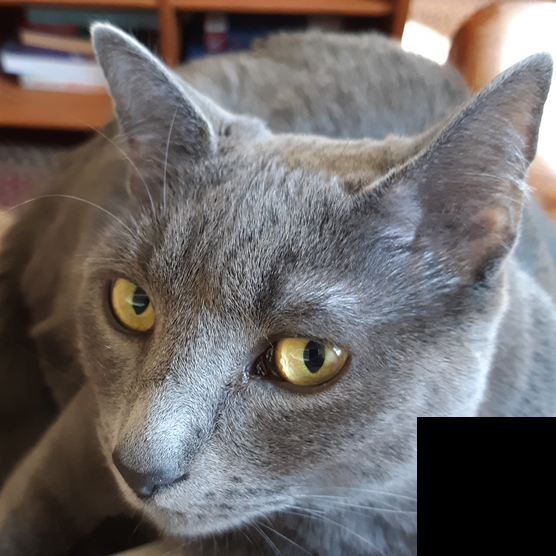

<div class='admonition caution'>
<div class='title'>Caution</div>
<div class='content'>
<ul>
<li>You are expected to work in pairs.</li>
<li><strong>Due: Friday, March 17th at 11pm EST (Baltimore time).</strong></li>
<li><em>This assignment is worth 140 points.</em></li>
<li>Late submissions will <b>not</b> be accepted! Please plan accordingly</li>
</ul>
</div>
</div>

<div class='admonition success'>
<div class='title'>Objectives</div>
<div class='content'>
<ul>
<li>structs</li>
<li>binary file I/O</li>
<li>nested loops</li>
<li>data representations</li>
<li>dynamic memory allocation</li>
<li>makefile</li>
<li>development tools <code>gdb</code>, <code>valgrind</code>, <code>git</code></li>
<li>unit tests</li>
</ul>
</div>
</div>

# Overview

TODO: What a 15 puzzle is.

TODO: Brief overview of what the program will do. (Note: the program needs to
be capable of manipulating arbitrary NxN puzzles.)

# Getting Started

TODO: Cloning your midterm project repository

TODO: Copying the starter code.

## Example of Program Functionality

<!--
TODO: brief example of program functionality (corresponding to one of
the test inputs in the starter code). Possible format could be:

* input file
* background image
* sequence of transformations on the puzzle (both tile locations
  and expected result image)
-->

This section shows a quick example of how the program works.

The example input shown here is in the file `test06.txt` included in
the starter files, so the following invocation could be used to run the
program with this input:

```
./puzzle test06.txt
```

The input file `test06.txt` has the following contents:

```
C 4
T 5 7 1 2 0 9 3 4 13 8 6 11 14 15 10 12
I ingo.ppm
W ingo_orig.ppm ingo_orig.txt
S l
S u
S l
S l
S r
S d
S r
S d
S l
S l
S u
S r
S u
S u
S r
S r
S d
S d
S d
S l
S l
S u
S r
S u
S l
S l
S u
W ingo_solved.ppm ingo_solved.txt
```

The meaning of each of these commands is fully described in the
[Input File Format](#input-file-format) section below. However, here is
a brief summary of what this input does:

1. Specifies that the puzzle is 4x4 (the `C` command)
2. Specifies a particular arrangement of tiles (the `T` command and
   the numbers that follow it)
3. Specifies that `ingo.ppm` is the background image for the puzzle
   (the `I` command)
4. Saves the initial (scrambled) configuration of the puzzle to image
   `ingo_orig.ppm` and text file `ingo_orig.txt` (the first `W` command)
5. Performs a series of moves (the `S` commands)
6. Saves the final solved configuration of the puzzle to the image
   `ingo_solved.ppm` and text file `ingo_solved.txt`
   (the second `W` command)

This is the background image (`ingo.ppm`):

<div class="puzzle_layout">
<a href="img/ingo.png"></a>
</div>

This is the initial scrambled puzzle configuration (the image is
`ingo_scrambled.ppm`):

<div class="puzzle_layout">
<table class="puzzle">
 <tr>
  <td>5</td><td>7</td><td>1</td><td>2</td>
 </tr>
 <tr>
  <td class="gap"></td><td>4</td><td>3</td><td>4</td>
 </tr>
 <tr>
  <td>13</td><td>8</td><td>6</td><td>11</td>
 </tr>
 <tr>
  <td>14</td><td>15</td><td>10</td><td>12</td>
 </tr>
</table>
<a href="img/ingo_scrambled.png"></a>
</div>

After all of the "S" commands complete, the puzzle is in its
"solved" configuration (the image is `ingo_solved.ppm`):

<div class="puzzle_layout">
<table class="puzzle">
 <tr>
  <td>1</td><td>2</td><td>3</td><td>4</td>
 </tr>
 <tr>
  <td>5</td><td>6</td><td>7</td><td>8</td>
 </tr>
 <tr>
  <td>9</td><td>10</td><td>11</td><td>12</td>
 </tr>
 <tr>
  <td>13</td><td>14</td><td>15</td><td class="gap">12</td>
 </tr>
</table>
<a href="img/ingo_solved.png"></a>
</div>

# Program Requirements

## Program Structure, Data Types

TODO: describe how source/header files are organized (data types
and function prototypes go in `puzzle.h`, helper functions go
in `puzzle_funcs.c`, main function goes in `puzzle.c`)

TODO: it's a requirement to have a data type to represent the
instance of the puzzle (i.e., `typedef struct { /*...*/ } Puzzle;`

TODO: it's a requirement to have appropriate helper functions
to do operations on an instance of the puzzle data type
(could list a few suggestions, e.g., `puzzle_create`,
`puzzle_set_tile`, etc.)

TODO: we expect that the program will use functions throughout the
program to simplify its implementation. For example, have one
function to implement each kind of supported command
(see the [Input File Format](#input-file-format) section)

## Input File Format

TODO: description of the input file format, with all of the commands

## Running the Program

TODO: invoking the program (0 args means read commands from stdin, 1 arg
means read commands from input file)

## Error Handling

TODO: the various kinds of errors that must be handled. Important
points:

* All error messages are printed to stderr
* All errors are "fatal" (cause the program to exit with exit code 1
  after printing the error message)
* Error message text is exact (we should give them a table based on
  the error messages from the reference solution)

## Reading and Writing PPM Files

TODO: brief description of PPM format (copy from image processing assignment?)

TODO: ways of viewing PPM files (remote X and feh program, view in VS Code)

TODO: brief description of how PPM files are used in the assignment,
in I command (read into memory) and W command (write an result image by
"carving up" the original image according to the current configuration of
the tiles in the puzzle)

## Memory Correctness

TODO: the program needs to be free of memory leaks and other memory errors
(such as out of bounds array accesses), should use valgrind when testing

# Testing

TODO: it's expected that there will be a test program (`puzzle_tests`)
which has unit tests for as many helper functions as possible. Basically,
any helper function that can be tested in a straightforward way
should have a test. Teams should expect to invest around the same amount
of effort in writing tests as in implementing the functions being tested.

## Packaging

TODO: the files submitted should include `puzzle.h`, `puzzle_funcs.c`,
`puzzle.c`, `puzzle_tests.c`, `Makefile`, `README`, and `gitlog.txt`.
Please do not include any PPM image files.

TODO: expectations for what targets the Makefile should have

TODO: describe what the README should contain

TODO: instructions for preparing a zipfile to upload to Gradescope
